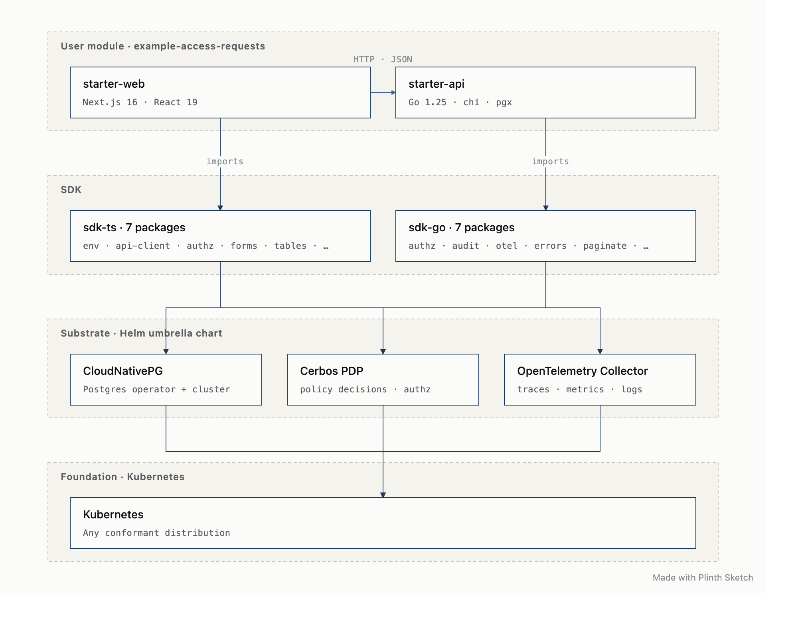

# `@plinth-dev/sketch`

> Render Plinth Sketch DSL files (`.sketch`) to typeset SVG architecture diagrams. Drop the DSL in your repo, render at build time, embed the SVG in your README.

A Node CLI + GitHub Action wrapping [Plinth Sketch](https://plinth.run/tools/sketch/) — the DSL-to-SVG diagram editor that powers the architecture diagrams on plinth.run. Same DSL, same output, available on your laptop and in CI.

```bash
$ plinth-sketch architecture.sketch
plinth-sketch: wrote architecture.svg
```

## Install

```bash
# As an npm dependency for build scripts:
npm install --save-dev @plinth-dev/sketch

# As a global CLI:
npm install -g @plinth-dev/sketch

# As a one-off, no install:
npx @plinth-dev/sketch architecture.sketch
```

## Usage

### CLI

```bash
plinth-sketch <input.sketch> [options]

  -o, --out <path>     Output file. Defaults to <input>.svg. '-' for stdout.
  -w, --watch          Re-render whenever the input file changes.
      --check          Parse + render only; exit 1 on errors. No file written.
      --no-signature   Suppress the "Made with Plinth Sketch" cite.
  -v, --version        Print version.
  -h, --help           Show this message.
```

Pipe DSL via stdin, write SVG to stdout:

```bash
cat architecture.sketch | plinth-sketch - > architecture.svg
```

Validate without writing — useful in pre-commit hooks:

```bash
plinth-sketch architecture.sketch --check
```

Watch mode for live editing:

```bash
plinth-sketch architecture.sketch -w
```

### Programmatic

```js
import { sketch, parse, layout, render } from "@plinth-dev/sketch";

// One-shot:
const svg = sketch(`
@layer Edge
gw : API Gateway / OIDC · rate-limit
@layer App
api : API tier / Go · chi
gw -> api
`);
fs.writeFileSync("arch.svg", svg);

// Or step through the pipeline:
const parsed = parse(dsl);
const lay = layout(parsed);
const svg = render(parsed, lay, { signature: false });
```

### GitHub Action

```yaml
# .github/workflows/diagrams.yml
name: Render diagrams
on:
  push:
    paths: ['**/*.sketch']

jobs:
  render:
    runs-on: ubuntu-latest
    steps:
      - uses: actions/checkout@v4
      - uses: plinth-dev/sketch@v0
        with:
          pattern: 'docs/**/*.sketch'
          commit: 'true'
```

The action runs `plinth-sketch` on every matching `.sketch` file and (optionally) commits the rendered `.svg` files back to the repo. Pair with `peter-evans/create-pull-request` to open a PR instead of committing directly.

| Input               | Default                          | Notes |
|---------------------|----------------------------------|-------|
| `pattern`           | `**/*.sketch`                    | Glob of files to render |
| `commit`            | `false`                          | Commit rendered SVGs back |
| `commit-message`    | `chore(sketch): re-render diagrams` | When `commit: true` |
| `fail-on-warnings`  | `false`                          | Non-zero exit on parse warnings |
| `signature`         | `true`                           | Include "Made with Plinth Sketch" cite |

## DSL

A `.sketch` file is line-based. Six rules cover everything:

```sketch
# Comments start with #.

# Set the current layer. Subsequent nodes belong to it.
@layer Layer name

# Nodes:  id : Label / sublabel
# (sublabel is optional)
api : API tier / Go · chi · pgx
db  : Postgres

# Edges:  a -> b : edge label
# (label is optional)
api -> db
api -> redis : cache lookups

# Optional bottom-right cite.
@cite Diagram by ACME, May 2026
```

That's the whole language. Layers stack vertically, nodes flow horizontally inside each layer, edges are auto-routed.

### Example

```sketch
@layer User module
web : starter-web / Next.js 16 · React 19
api : starter-api / Go 1.25 · chi · pgx

@layer SDK
sdk-ts : sdk-ts · 7 packages / env · api-client · authz · forms · tables · …
sdk-go : sdk-go · 7 packages / authz · audit · otel · errors · paginate · …

@layer Substrate
pg   : CloudNativePG / Postgres operator + cluster
cerb : Cerbos PDP / policy decisions · authz
otel : OpenTelemetry Collector / traces · metrics · logs

@layer Foundation
k8s : Kubernetes / Any conformant distribution

web -> api : HTTP · JSON
web -> sdk-ts : imports
api -> sdk-go : imports
sdk-ts -> cerb
sdk-go -> pg
sdk-go -> cerb
sdk-go -> otel
pg -> k8s
cerb -> k8s
otel -> k8s
```

Renders to:



## Why a custom DSL?

Mermaid's diagrams use the framework's default visual language — generic teal-on-navy boxes that look the same in every README on GitHub. Sketch emits diagrams in **Plinth's** design language: IBM Plex Sans, JetBrains Mono sublabels, sober navy strokes, dashed layer containers, off-white background. The whole point is that the diagram identifies the project that produced it.

The DSL is also deliberately tiny — six syntactic forms, line-based, no nesting. You can write it by hand without an editor mode, you can hand it to `git diff` and read the diff, you can scaffold it from another tool's output.

## Limitations

- Auto-layout is one-pass. Layers stack top-to-bottom; nodes flow left-to-right inside each layer; the canvas auto-grows to honour a 140px minimum node width. **Dense graphs (>6 nodes per layer) read better when split into more layers.**
- Edge routing is orthogonal L-paths. **Same-row edges that skip over an intervening node will draw through it** — a known limitation; reorder or split layers if it bites.
- No icon/image support — labels are plain text.
- No theme parameters (yet). Output is locked to the Plinth design language.

## Roadmap

- `@theme dark` switch for dark-mode embed
- Inline SVG `<title>` per node for hover-tooltip support in browsers
- A live editor at [plinth.run/tools/sketch/](https://plinth.run/tools/sketch/) (already in production)

## License

MIT.
